# High Performance Python by Micha Gorelick & Ian Ozsvald

---

## 1. Understanding Performant Python
## 2. Profiling to Find Bottlenecks
## 3. List and Tuples
## 4. Dictionaries and Sets
## 5. Iterators and Generators
## 6. Matrix and Vector Computation
## 7. Compiling to C
## 8. Asynchronous I/O
## 9. The multiprocessing Module
## 10. Clusters and Job Queues
## 11. Using Less RAM
## 12. Lessons from the Field

---

# 1. Understanding Performant Python

## The Fundamental Computer System

The underlying components that make up a computer can be simplified into three basic parts: ***the computing units***, ***the memory units***, and ***the connections between them***. In addition, each of these units has different properties that we can use to understand them. The computational units has the property of how many computations it can do per second, the memory unit has the properties of how much data it can hold and how fast we can read from and write to it, and finally, the connections have the property of how fast they can move data form one place to another.

Using these building blocks, we can talk about a standard workstation at multiple levels of sophistication. For example, the standard workstation can be thought of as having a central processing unit (CPU) as the computational unit, connected to both the random access memory (RAM) and the hard drive as two separate memory units ( each having different capacities and read/write speeds), and finally a bus that provides the connections between all of these parts. However, we can also go into more detail and see that the CPU itself has several memory units in it: the L1, L2, and sometimes even the L3 and L4 cache, which have small capactiies but very fast speeds ( from several kilobytes to a dozen megabytes ). Furthermore, new computer architectures generallly come with new configurations (for example, Intel's SkyLake CPUs replaced the frontside bus with the Intel Ultra Path Interconnect and restructured many connections). Finally, in both of these approximations of a workstation we have neglected the network connection, which is effectively a very slow connection to potetionally many other computing and memory units.

### Computing Units

The *computing unit* of a computer is the centerpiece of its usefulness - it provides the ability to transofmr any bits it receives into other bits or to change the state of hte vcurrent process. CPUs are the most commonly used for computing unit; however, graphics processing units (GPUs) are gaining popularity as auxiliary computing units. They were orignally used to speed up computer graphics but are becoming more applicable for numerical applications and are useful thanks to their intrinsically parallel nature, which allows many calculations to happen simultaneously. Regarldess of its type, **a computing unit takes a series of bits** (for example, bits representing numbers) **and outputs another set of bits** (for example, bits representing the sum of those numbers). In addition to the basic arithmetic operations on integers and real numbers and bitwise operations on binary numbers, some computing units also provide very specialized operations, such as the "fused multiply add" operation, which takes in threee numbers A, B, and C, and returns the value ```A*B + C```.

**The main properties** of interest in a comuting unit are **the number of operations it can do in one cycle** and **the number of cycles it can do in one second**. The first value is measured by its **insturctions per cycle (IPC)**, whithe the latter is measured by its **clock speed**. These two measures are always competing with each other when new computing units are being made. For example, the Intel Core series has a very high IPC but a lower clock speed, while the Pentium 4 chip has the reverse. GPUs, on the other hand, hav ea very high IPC and clock speed, but they suffer from other problems like the slow communications.

Furthermore, although increaseing clock speed almost immeidately speeds upa ll programs running on that computational unit (because they ar eable to do more calculations per second), **having a higher IPC can also drastically affect computing by changing the level of vectorization that is possible.**
**Vectorization occurs when a CPU is provided with multiple pieces of data at a time and is able to operate on all of them at once. This sort of CPU instruction is known as single instruction, multipel data (SIMD).**

In general, computing units have advanced quite slowly over the past decade. Clock speeds and IPC have both been stagnant because of the physical limitations of making transistors smaller and smlaler. As a reuslt, **chip manufacturers have been relying on other methods to gain more speed**, including **simultaneous multithreaiding** (where multiple threads can run at once), more clever **out-of-order execution**, and **multicore architectures**.

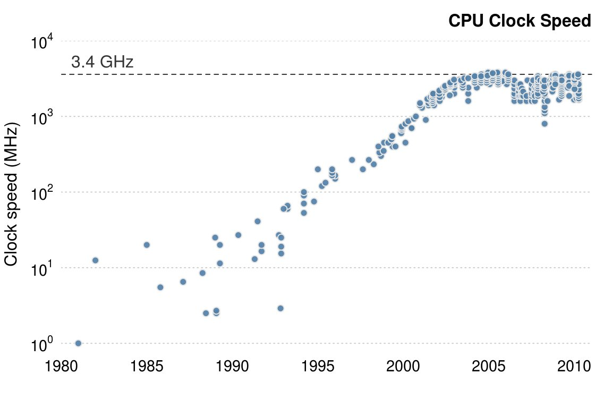

**Hyperthreading** presents a virutal second CPU to the host operationg system (OS), and clever hardware logic tries to interleave two threads of insturctions into the exeuction units on a single CPU. When successful, gains of up to 30% over a single thread can be achieved. Typically, this works well when the units of work across both threads use different types of executin units - for example, one performs floating-point operations and the other performs integer operations.

**Out-of-order execution** enables a compiler to spot that some parts of a linear program sequence do not depend on the reuslts of a previous piece of work, and therefore that both pieces of work could occur in any order or at the same time. As long as sequential results are presented at the right time, the program continues to execute correctly, even though pieces of work are computed out of their programmed order. This enables some instructions to execute when other might be blocked (e.g., waiting for a memory access), allowing greater overall utilization of the avaialble resources.

**Multicore architectures** include multiple CPUs withing the same unit, whcih increases the total capability without running into barriers to making each individual unit faster. This is why it is currently hard to find any machine with fewer that wo cores - in this case, the compute rhas two physical computing units that are connected to each other. While this increases the total number of operations that *can* be done per second, it can make writing code more difficult!

Simply adding more cores to a CPU does not always speed up a program's exeuction time. This is because of something known as *Amdahl's law*:

> *Amdahl's law*: if a program designed to run on multiple cores has some subroutines that must run on one core, this will be the limitation for the maximum speedup that can be achieved by allocating more cores.

For example, if we had a survey we wanted one hundred people to fill out, and that survey took 1 minute to complete, we could complete thsi task in 100 minutes if we had one person asking the questions (i..e, this person goes to participatn 1, ask s the questions, wait s fo rthe responses, and then moves to participant 2). This method of having one person asking the questions and waiting for responses is similar to a serial prcoess. In serial processes, we have operations being satisfied one at a time, each one waiting for the previous operations to complete.

However, we could perfomr the survey in parallel if we had two people asking the questions, which would let us finish the process in only 50 minutes. This can be done because each individual person asking the questions does not need to know anything about the other person asking questions. As a result, the task can easily be split up without having any dependency between the question askers.

Adding more people asking the questions will give us more speedups, until we have one hundred people asking questions. At this pint, the process would take 1 minutes and would b elimited simply by the time it takes a participant to answer questions. Adding more epopel asking questions will not result in any further speedups ,because these extra people will have no tasks to perform - all the participants are already being asked questions! At this point, the only way to reduce the overall time to run the survey is to **reduce the amount of time it takes for an individual survey, the serial portion of the problem, to complete.** Similarly, with CPUs, we can add more cores that can perform various chunks of the computation as necessaru until we reach a piont where the bottleneck is the time it takes for a specific core to fnish its task. **In other words, the bottleneck in any parallel calculation is always the smaller serial tasks that are being spread out.**

Furthermore, a major hurdle with utilizing multiple cores in Python is Python's use of a *global interpreter lock (GIL)*. The GIL makes sures that a Python process can run only one insturction at a time, regardless of the number of cores it is currently using. This means that even though some Python code has access to multiple cores at a time, only one core is running a Python instruction at any given time. Using the previous example of a survey, this would mean that even if we had 10 question askers, only one person could ask a question and listen to a response at a time. This effectively removes any sort of benefit from having multiple question askers! While this may seem like quite a hurdle, especially if hte current tnred in computing is to have multiple computing units rather than having afster ones, **this problem can be avoided by using other standard library tools, like ```multiprocessing```, technologies like ```numpy``` or ```numexpr```, ```Cython```, or distributed models of computing.**

### Memory Units

**Memory units in computers are used to store bits.** These could be bits representing variables in your program or bits representing the pixels of an image. Thus, the abstraction of a memory units applies to the registers in your motherboard as well as your RAM and hard drive. **The one major difference** between all of these types of memory units **is the speed at which they can read/write data.** To make things more complicated, the read/write speed is heavily dependent on the way that data is being read.

For example, most memory units perform much better when they read one large cunks of data as opposed to many small chunks (this is referred to as *sequential read* versus *random data*). If the data in these memory units is though of as pages in a large book, this means that most memory units have better read/write speeds when going through the book page by page rather tha constantly flipping from one random page to another while this fact is gneerally true across all memory units, the amount that this affects each type is drastically different.

In addition to the read/write speeds, memory units also have **latency**, which can be characterized as **the time it takes the device to find the data that is being used**. For a spinning hard drive, this latenc ycan be high because the disk needs to physically spin up to speed and the read head must move to the right position. On the other hand, for RAM, this latency can be quite small because everything is solid state. Here is a description of hte various memory untis htat are commonly found inside a standard workstation, on order of read/write speeds:

* *Spinning hard drive*
    * Long-term storage that persists even when the computer is shut down. Generally has slow read/write speeds because the disk must be physically spun and moved. Degraded performance iwth random access patterns but very large capacity (10 terabyte range).
* *Solid-state hard drive*
    * Similar to a spinning hard drive, with faster read/write speeds but smaller capacity (1 terabyte range).
* *RAM*
    * Used to store application code and data (such as any variables being used). Has fast read/write cahracteristics and performs well with random access paterns, but is generally limited in capacity (64 gigabyte range).
* *L1/L2 cache*
    * Exteremly fast read/write speeds. Data going to the CPU *must go* through here. Very small capacity (megabytes range).

The following figure gives a graphic representaiton of the differneces between these types of memoyr units by looking at the characteristics of currently available consumer hardware:

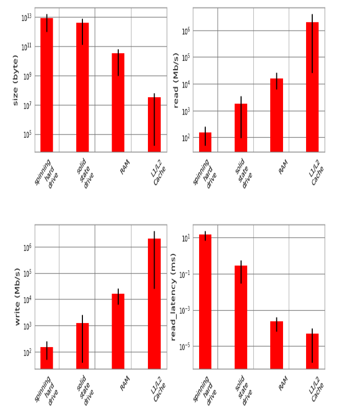

A clearly visible trend is that read/write speeds and capacity are inversely proportional - ***as we try to increase speed, capacity gets reduced***. Because of this , many systems implemented a tiered approach to memory: data starts in its full state in the hard drive, part of it moves to RAM, and then a much smaller subset moves to the L1/L2 cache. This method of tiering enables programs to keep memory in different places depending on access speed requirements. **When trying to optimize the memory patterns of a program, we are simply optimizing which data is placed where, how it is laid out (in order to increase the number of sequential reads), and how mnay times it is moved among the variosu locations.** In addition, methods such as asynchronous I/O and preemptive caching provide ways to make sure that data is always where it needs to be without having to waste computing time - most of these processes can happen independently, while other calculations are being performed!

### Communications Layer

**Many modes of communication exist, but all are variants on a thing called a bus.**

The **frontside bus**, for example, is the **connection between the RAM and the L1/L2 cache.** It mvoes data that is ready to be transformed by the processor into the staging ground to get ready for calculation, nad it moves finished calculations outs. There are other buses, too, such as **the external bus** that acts as the **main route from hardware devices to the CPU and system memory.** The external bus is generally slower than the frontside bus.

In fact, many of the benefits of the L1/L2 cache are attributable ot hte faster bus. BEing able to queue up data necessary for computation in large chunks on a low bus ( from RAM to cache) and then having it available at very fast speeds from the cache lines (from cache to CPU) enable sthe CPU to do more calculations without waiting such a long time.

Similarly, many of the drawbacks of using a GPU come from the bus it is connected on: **since the GPU is generally a peripheral device, it communicates through the PCI bus, which is much slower than the frontside bus.** As a reuslt, **geting data into and out of the GPU can be qutie a taxing operation.** The advent of heterogeneous computing, or computing blocks that have both a CPU and a GPU on the frontside bus, aims at reducing the data transfers cost and making GPU comptuing more of an avaialable option, even when a lot of data must be transferred.

In addition to the communication blocks withing the computer, the network can be though of as yet another communication block. This block, though, is much more pliable than the ones discucseed previously; a network device can be connected to a memory device, such as a network attached storage (NAS) device or another computing block, as in a computing node in a cluster. However, networkg communications are generally much slower than the other types of communications mentioned previously. While the frontside bus can transfer doznes of gigabits per second, the network is limited to the order of several dozen megabits.

It is clear, then, that **the main propery of a bus is its speed: how mcuh data it can move in a given amount of time.** This property is given by combining two quantities: **how mcuh data can be moved in one transfers (bus width)** and **how many transfers the bus can do per second (bus frequency).** It is important to note that the **data moved in one transfer is always sequential: a chunk of data is read off of the memory and moved th a different place.** Thus, the speed of a bus is borken into these two quantities because individually they can affect different aspects of computation: **a lareg bus width can help vectorized code (or any code that sequentially reads through memory) by making it possible to move all the relevant data in one tranfer**, while, on the other hand, **having a small bus with but a very high frequency of transfers can help code that must do many reads from random parts of memory.** Interestingly, one of the ways that these properties are changed by computer designers is by the physical layout of the motherboard: when chips are placed close to another one, the lenght of the phhysical wires joining them is smaller, which can allow for faster transfer sppeds. In addition, the number of wires itself dictates the widht of the bus (giving real physical meaning to the term).

Since interface can be ve the right performance for a specific application, it is no surprise that there are hundred of types. The following figure shows the bitrates for a sampling of common interfaces. Note that htis doesn't speak at all about the latency of the connections, which dictates how long it teakes for a data request to be responeded to (although latency is very computer-dependent, some basic limitations are inherent to the interfaces being used).

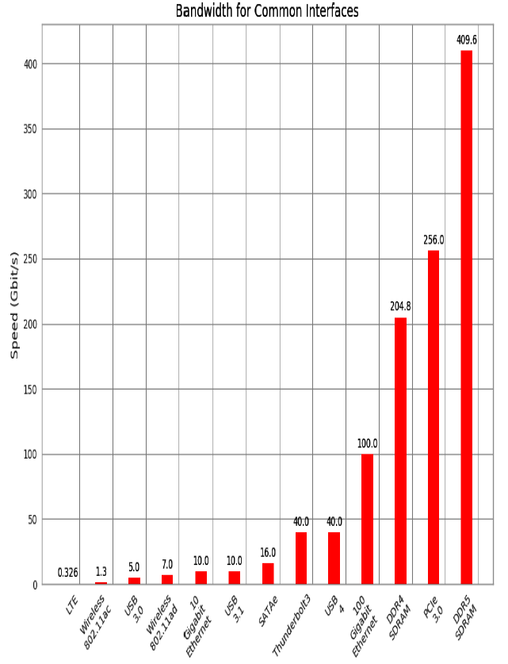

## How to be a highly performant programmer

Writing high performance code is only one part of being highly performant with successful projects over the longer term. Overall team velocity is far more important than speedups and complicated solutions. Several factors are key to this - good structure, documentation, debuggability, and shared standards.

Let's say you create a prototype. You didn't test it thoroughly, and it didn't get reviewed by yourr team. It does seem to be "good enough", and it gets pushed to production. Since it was never written in a structured way, it lacks tests and is undocumented. All of a sudden there's an inertia-causing piece of code for someone else to support, and often management can't quantify the cost to the team.

As this solution is hard to maintian, it tends to stay unloved - it never gets restructured, it doesn't get the tests that'd help the team refactor it, and nobody else like to touch it, so it falls to one developer to keep it running. This can cause an awful bottleneck at times of stress and raises a significant risk: what would happen if that developer left the project?

Typically, this development style occurs when the management team doesn't understand the ongioing inertia that's cause by hard-to-maintain code. Demonstrating that in the longer-term tests and documentation can hlep a team stay highly productive and can help convince managers to allocate time to "cleaning up" this prototype code.

In a research environment, it is commong ot create many Jupyter Notebooks using poor coding practices whiel tierating through ideas and different datasets. The intention is alwyas to "write it up properly" at a later stage, but that later stage never occurs. In the ends, a working result is obtained ,but the infrastrucutre to reproduce it, test it, and trust the result is missing. Once again the ris kfasctors are high, and the truste in the reuslt will be low.

There's a general approach that will serve you well:

* *Make it work*
    * First you build a good-enough solution. It is very sensible to "build one to throw away" that acts as a prototype solution, enabling a better structure to be used for the second version. It is always sensible to do some up-front plnning before coding; otherwise, you'll come to reflect that "We saved an hou'rs thinking by coding all afternoon." In some fields this is better known as "Mesaure twice, cut once."
* *Make it right*
    * Next, you add a strong test suite backed by documentation and clear reproducibility insturctions so that another team member can take it on.
* *Make it fast*
    * Finally, we can focus on profiling and compiling or parallelization and using the existing test usite to confirm that hte new, faster solution still works as expected.

## Good Working Practices

***There are a few "must haves" - documentation, good structure, and testing are key.***

**Some project-level documentation** will help you stick to a clean structure. It'll also help you and your colleagues in the future. Nobody will thank you if you skip this part. Writing this up in a *READMDE* fil at the top level is a sensible starting point; it can always be expaneded into a ```docs/``` folder later if required.
Explain the purpose hf the project, what's in the folders, where the data comes from, which files are critical, and how to run it all, including how to run the tests.

**It is recommended to use Docker.** A top-level Dockerfile will explain to your future-self exactly which libraries you need from the operatin system to make this project run successfully. It also removes the difficulty of running this code on other machines or deploying it to a cloud environment.

**Add a ```tests/``` folder and add some unit tests.** Preferable is ```pytest``` as a modern test runner, as it builds on Python's built-in ```unittest``` module. Start with just a couple of tests and then build them up. Progress to using the ```coverage tool```, which will report how many lines of your code are actually covered by the tests - it'll help avoid nasty surprises.
If you're inheriting legacy code and it lacks test, a high-value activity is to add some tests up front. Some "integration tests" that check the overall flow of the project and confirm that with certain input data you get specific output results will help your sanity as you subsequently make modifications.

**Docstrings** in your code for each function, class and module will always help you. Aim to provide a useful description of what's achieved by the function, and where possible include a short example to demonstrate the expected output.

Whenver your code becomes too long - such as functions logner than one screen - be comforatble with refactoring the code to make it shorter. ***Shorted code is easier to test and easier to support.***

> When you're developing tests, think about following a test-driven development methodology. Whne you know exactly what ou need to develop and you have testable example s at hand - this method become very efficient.
>
> You write your tests, run them, watch them fail, and *then* add the funcitons and the necessary minimum logic to support the tests that you've written. When your tests all work, you're done. By figuring out the expected input and output of a function ahead of time, you'll find implementing the logic of the function relatively straight forward.
>
> If you can't define yuor ests ahead of time, it naturally riase sthe question, do you real understand what your function needs to do? If not, can you write it correctly in an efficient manner?
>
> ***This method doesn't work so well if you're in a creative process and researching data that you don't yet understand well.***

**Always use source control** - you'll only thank yourself when you overwrite something critical at an inconvenient moment. Get used to committing frequently (daily, or even every 10 minutes) and pushing to your repository every day.

**Keep to the standard PEP8 coding standard.** Even better, adopt **```black```** (the opinionated code formatter) on a pre-commit source control hook so it just rewrite your code to the standard for you. Use **```flake8```** to lint your code to avoid mistakes.

**Creating environments that are isolated from the operatinog system will make your life easier.** You can use Anaconda or a combination between ```pipenv``` and Docker. Both are sensible solutions and are significanlty better than using the operating system's global Python environment!

**Remember that automation if your friend.** Doing less manual work means there's less chance of errors creeping in. Automated build systems, continuous integrationg with automated test suite runners, and automated deployment systems turn tedious and error-prone tasks into standard processes that anyone can run and support.

Finally, remmeber that ***readability is far mroe improtant than being clever.*** Short sinppets of complex and hard-to-read code will be hard for you and your colleagues to maintain, so people will be scared of touching this code. Instead, write a longer, easier-to-read function and back it with useful documentation showing that it'll returng, and complement this with tests to confirm that it *does* work as you expect.

# 2. Profiling to Find Bottlenecks

## What is profiling

***Profiling lets us find bottlenecks so we can do the least amount of work to get the biggest practical performance gain.***

Any measurable resource can be profiled, not just the CPU. You can apply profiling techniques to network bandwidth and disk I/O as well.

If a program is running slowly because it's using too much RAM then you should identify the part of the program that does that and modify it. You can also skip profiling at this point and change whatever it is that you *believe* is wrong with the code. The problem with using your intuition is that you'll often end up fixing the wrong thing. **Rather than using your intuition, it is far better to first profile, having defined a hypothesis, before making changes to the structure of your code.**

```-> >```

## Profiling efficiently

The first aim of profiling is to **test a representative system to identify what's slow** (or using too much RAM, or causing too much disk I/O or network I/O). Profiling typically adds an overhead (10x to 100x slowdowns can be typical), and you still want your code to be used in as similar to a real-world situation as possible. Extract a test case and isolate the piece of the system that you need to test. Preferably, it'll have been written to be in its own set of modules already.

Whatever approach you take to profiling your code, you must remember to have adequate unit test coverage in your code. Unit tests help you to avoid silly mistakes and to keep your results reproducible. Avoid them at your peril.

*Always* profile your code before compiling or rewriting your algorithms. You need evidence to determine the most efficient ways to make your code run faster.

## Introducing the Julia Set

The Julia set is a fractal sequence that generates a complex output image.

We will analyze a block of code that produces both a false grayscale plot and a pure grayscale variant of the Julia set, at the complex point ```c=-0.62772 -0.42193j```. A Julia set is produced by calculating each pixel in isolation.

The following figure is a Julia set plot with a false gray scale to highlight detail:


If we chose a different ```c```, we'd get a different image. The location we have chosen has regions that are quick to calculate and other that are slow to calculate; this is useful for our analysis.

The problem is interesting because we calculate each pixel by applying a loop that could be applied an indeterminate number of times. On each iteration we test to see if this coordinate's value escapes toward infinity, or if it seems t be held by an attractor. Coordinates that cause few iterations are colored darkly in the figure above, and those that cause a high number of iterations are colored white. White regions are more complex to calculate and so take longer to generate.

We define a set of ```z``` coordinates that we'll test. The function that we calculate squares the complex number z and adds c: ```f(z) = z^2 + c```.

We iterate on this function while testing to see if the escape condition holds using ```abs```. If the escape function is ```False```, we break out of the loop adn record the number of iterations we performed at this coordinate. If the escape function is never ```False```, we stop after ```maxiter``` iterations. We will later turn this ```z```'s result into a colored pixel representing this complex location.

In pseudocode, it might look like this:

```
for z in coordinates:
  for iteration in range(maxiter):  # limited iterations per point
    if abs(z) < 2.0:  # has the escape condition been broken?
      z = z*z + c
    else:
      break
  
  # store the iteration count for each z and draw later
```

To explain this function, let's try two coordinates.

We'll use the coordinate that we draw in the top-left corner of the plot at ```-1.8-1.8j```. We must test ```abs(z)``` < 2 before we can try to update rule:

```python
z = -1.8-1.8j
print(abs(z))

"""
Output:

z = -1.8-1.8j
print(abs(z))
"""
```

We can see that for the top-left coordinate, the ```abs(z)``` test will be ```False``` on the zeroth iteration as ```2.54 >= 2.0```, so we do not perform the update rule. The ```output``` value for this coordinate is ```0```.

Now let's jump to the center of the plot at ```z = 0 + 0j``` and try a few iterations:

```python
c = -0.62772-0.42193j
z = 0+0j
for n in range(9):
    z = z*z + c
    print(f"{n}: z={z:.5f}, abs(z)={abs(z):0.3f}, c={c:.5f}")

"""
Output:

0: z=-0.62772-0.42193j, abs(z)=0.756, c=-0.62772-0.42193j
1: z=-0.41171+0.10778j, abs(z)=0.426, c=-0.62772-0.42193j
2: z=-0.46983-0.51068j, abs(z)=0.694, c=-0.62772-0.42193j
3: z=-0.66777+0.05793j, abs(z)=0.670, c=-0.62772-0.42193j
4: z=-0.18516-0.49930j, abs(z)=0.533, c=-0.62772-0.42193j
5: z=-0.84274-0.23703j, abs(z)=0.875, c=-0.62772-0.42193j
6: z=0.02630-0.02242j, abs(z)=0.035, c=-0.62772-0.42193j
7: z=-0.62753-0.42311j, abs(z)=0.757, c=-0.62772-0.42193j
8: z=-0.41295+0.10910j, abs(z)=0.427, c=-0.62772-0.42193j
"""
```

We can see that each update to ```z``` for these first iterations leaves it with a value where ```abs(z) < 2``` is ```True```. For this coordinate we can iterate 300 times, and still the test will be ```True```. We cannot tell how many iterations we must perform before the condition becomes ```False```, and this may be an infinite sequence. The maximum iteration (```maxiter```) break clause will stop us from iteration potentially forever.

In the following figure, we see the first 50 iterations of the preceding sequence. For ```0+0j``` (the solid line with circle markers), the sequence appears to repeat every eighth iteration, but each sequence of seven calculations has a mnior deviation from the previous sequence - we can't tell if this point will iterate forever within the boundary condition, or for a long time, or maybe for just a few more iterations. The dashed ```cutoff``` line shows the boundary at +2:

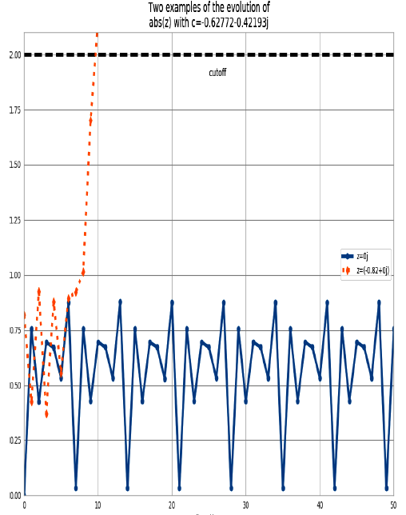

For ```-0.82+0j``` (the dashed line with diamond markers), we can see that after the ninth update, the absolute result has exceeded the +2 cutoff, so we stop updating this value.

## Calculating the Full Julia Set

At the start of our module we import the ```time``` module for our first profiling approach and define some coordainte constants.

```python
"""Julia set generator without optional PIL-based image drawing"""
import time

# area of complex space to investigate
x1, x2, y1, y2 = -1.8, 1.8, -1.8, 1.8
c_real, c_imag = -0.62772, -.42193
```

To generate the plot, we create two lists of input data. The first is ```zs``` (complex ```z``` coordinates), and the second is ```cs``` (a complex initial condition). Neither list varies, adn we could optimize ```cs``` to a single ```c``` value as a constant. The rationale for building two input lists is so that we have some reasonable-looking data to profile when we profile RAM  usage later in this chapter.

To build the ```zs``` and ```cs``` lists, we need to know the coordinates for each ```z```. In the following example, we build up these coordinate using ```xcoord``` and ```ycoord``` and a specified ```x_step``` and ```y_step```. The somewhat verbose nature of this setup is useful when porting the code to other tools (such as ```numpy```) and to other Python environments, as it helps to have everything *very* clearly defined for debugging:

```python
def calc_pure_python(desired_width, max_iterations):
  """Create a list of complex coordinates (zs) and complex parameters (cs), build Julia set"""
  x_step = (x2 - x1) / desired_width
  y_step = (y1 - y2) / desired_width

  x = []
  y = []

  ycoord = y2
  while ycoord > y1:
    y.append(ycoord)
    ycoord += y_step

  xcoord = x1
  while xcoord < x2:
    x.append(xcoord)
    xcoord += x_step

  # build a list of coordinates and the initial condition for each cell
  # Note that ur initial condition is a constant and could easily be removed,
  # we use it to simulate a real-world scenario with several inputs to our
  # function

  zs = []
  cs = []
  for ycoord in y:
    for xcoord in x:
      zs.append(complex(xcoord, ycoord))
      cs.append(complex(c_real, c_imag))

      print("Length of x:", len(x))
      print("Total elements:", len(zs))
      start_time = time.time()
      output = calculate_z_serial_purepython(max_iterations, zs, cs)
      end_time = time.time()
      secs = end_time - start_time
      print("{0} took {1} seconds".format(calculate_z_serial_purepython.__name__, secs))

      # This sum is expected for a 1000^2 grid with 300 iterations
      # It ensures that our code evolves exactly as we'd intended
      assert sum(output) == 33219980
```

Having built the ```zs``` and ```cs``` lists, we output some information about the size of hte lists and calculate the ```output``` list via ```calculate_z_serial_purepython```. Finally, we ```sum``` the contents of ```output``` and ```assert``` that it matches the expected output value.

As the code is deterministic, we can verify that the function works as we expect by summing all the calculated values. This is useful as a sanity check - when we make changes to numerical code, it is *very* sensible to check that we haven't broken the algorithms. Ideally, we could use unit tests and test more than one configuration of the problem.

Next, in the following example, we define the ```calculate_z_serial_purepython``` function, which expands on the algorithm we discussed earlier. Notably, we also define an ```output``` list at the start that has the same length as the input ```zs``` and ```cs``` lists:

```python
def calculate_z_serial_purepython(maxiter, zs, cs):
  """Calculate output list using Julia update rule"""
  output = [0] * len(zs)
  for i in range(len(zs)):
    n = 0
    z = zs[i]
    c = cs[i]

    while abs(z) < 2 and n < maxiter:
      z = z * z + c
      n += 1

    output[i] = n

  return output
```

Now we call the calculation routine in the next example. By wrapping it an a ```__main__``` check, we can safely import the module without starting the calculations for some of the profiling methods. Here, we're not showing the method used to plot the output:
    
```python
if __name__ == '__main__':
  # Calculate the Julia set using a pure Python solution with
  # reasonable defaults for a laptop
  calc_pure_python(desired_width=1000, max_iterations=300)

"""
Output:

Length of x: 1000
Total elements: 7172
calculate_z_serial_purepython took 0.015624761581420898 seconds
"""
```

In the false-grayscale plot, the high-contrast color changes gave us an idea of where the cost of the function was slow changing or fast changing. Here, in the following figure, we have a linear color map: black is quick to calculate, and white is expensive to calculate.

By showing two representations of the same data, we can see that lots of detail is lost in the linear mapping. Sometimes it can be useful to have various representations in mind when investigating the cost of a function:


## Simple Approaches to Timing - print and a Decorator

You must observe the normal variation when you're timing your code, you might incorrectly attribute an improvement in your code to what is simply a random variation in execution time.

Your computer will be performing other tasks while running your code, such as accessing the network, disk, or RAM, and these factors can cause variations in the execution time of your program.

Using ```print``` statements is the simplest way to measure the execution time of a piece of code *inside* a function. It is a basic approach, but despite being quick and dirty, it can be very useful when you're first looking at a piece of code.

Using ```print``` statements is commonplace when debugging and profiling code. It quickly become unmanageable but is useful for short investigations. Try to tidy up the ```print``` statements when you're done with them, or they will clutter your ```stdout```.

A slightly cleaner approach is to use a *decorator*:

```python
from functools import wraps

def timefn(fn):
  @wraps(fn)
  def measure_time(*args, **kwargs):
    t1 = time.time()
    result = fn(*args, **kwargs)
    t2 = time.time()
    print(f"@timefn: {fn.__name__} took {t2 - t1} seconds")
    return result

  return measure_time


@timefn
def calc_pure_python(desired_width, max_iterations):
    ...
```

> The addition of profiling information will inevitably slow down your code - some profiling options are very informative and induce a heavy speed penalty. The trade-off between profiling detail and speed will be something you have to consider.

We can use the ```timeit``` module as another way to get a coarse measurement of the execution speed of our CPU-bound function.

> The ```timeit``` module temporarily disabled the garbage collector. This might impact the speed you'll see with real-world operations if the garbage collector would normally be invoked by your operations.

From the command line, you can run ```timeit``` as follows:

```bash
$ python -m timeit -n 5 -r 1 -s "import julia" \
  "julia1.calc_pure_python(desired_width=1000, max_iterations=300)"
```

```n``` is the number of loops and ```-r``` is the number of repetitions. The best result of all repetitions is given as the answer.

## Using the cProfile Module

```cProfile``` is a built-in profiling tool in the standard library. It hooks into the virtual machine in CPython to measure the time taken to run every function that it sees. This introduces a greater overhead, but you get correspondingly more information. Sometimes the additional information can lead to surprising insights into your code.

```cProfile``` is one of two profilers in the standard library, alongside ```profile.profile``` is the original and slower pure Python profiler; ```cPorfile``` ahs teh same interface as ```profile``` and is written in ```C``` for a lower overhead.

***A good practice when profiling is to generate a hypothesis about the speed of parts of your code before you profile it. Forming a hypothesis ahead of time means you can measure how wrong you are (and you will be!) and improve your intuition about certain coding styles.***

> You should never avoid profiling in favor of a gut instinct. It is definetly worth forming a hypothesis ahead of profiling to help you learn to sport possible slow choices in your code, and you should always back up your choices with evidence

Always be driven by results that you have measured, and always start with some quick-and-dirty profiling to make sure you're addressing the right area.

Let's hypothesize that ```calculate_z_serial_purepython``` is the slowest part of the code. In that function, we do a lot of dereferencing and make many calls to basic arithmetic operators and the ```abs``` function. These will probably show up as consumers of CPU resources.

Here, we'll use the ```cProfile``` module to run a variant of the code. The output is spartan but helps us figure out where to analyze further.

The ```-s cumulative```  flag tells ```cProfile``` to sort by cumulative time spent inside each function; this gives us a view into the slowest parts of a section of code. The ```cProfile``` output is written to screen directly after our unusual ```print``` results:

```bash
$ python -m cProfile -s cumulative julia.py

Length of x: 1000
Total elements: 1
calculate_z_serial_purepython took 1.1444091796875e-05 seconds
         2037 function calls in 0.000 seconds

   Ordered by: cumulative time

   ncalls  tottime  percall  cumtime  percall filename:lineno(function)
        1    0.000    0.000    0.000    0.000 {built-in method builtins.exec}
        1    0.000    0.000    0.000    0.000 julia.py:1(<module>)
        1    0.000    0.000    0.000    0.000 julia.py:11(measure_time)
        1    0.000    0.000    0.000    0.000 julia.py:21(calc_pure_python)
        3    0.000    0.000    0.000    0.000 {built-in method builtins.print}
     2002    0.000    0.000    0.000    0.000 {method 'append' of 'list' objects}
        1    0.000    0.000    0.000    0.000 {method 'format' of 'str' objects}
        1    0.000    0.000    0.000    0.000 julia.py:10(timefn)
        1    0.000    0.000    0.000    0.000 julia.py:65(calculate_z_serial_purepython)
        1    0.000    0.000    0.000    0.000 functools.py:34(update_wrapper)
        1    0.000    0.000    0.000    0.000 {built-in method builtins.abs}
        1    0.000    0.000    0.000    0.000 functools.py:64(wraps)
        7    0.000    0.000    0.000    0.000 {built-in method builtins.getattr}
        5    0.000    0.000    0.000    0.000 {built-in method builtins.setattr}
        3    0.000    0.000    0.000    0.000 {built-in method time.time}
        1    0.000    0.000    0.000    0.000 {method 'update' of 'dict' objects}
        4    0.000    0.000    0.000    0.000 {built-in method builtins.len}
        1    0.000    0.000    0.000    0.000 {built-in method builtins.sum}
        1    0.000    0.000    0.000    0.000 {method 'disable' of '_lsprof.Profiler' objects}
```

Sorting by cumulative time gives us an idea about where the majority of execution time is spent. This result shows us that 36.221.995 function calls occurred in just over 12 seconds (this time includes hte overhead of using ```cProfile```). Previously, our code took around 8 seconds to execute - we've just added a 4-second penalty by measuring how long each function takes to execute.

We can see that the entry point to the code ```julia.py``` on line 1 takes a total of 12 seconds. This is just the ```__main__``` call to ```calc_pure_python```. ```ncalls``` is 1, indicating that this line is executed only once.

Inside ```calc_pure_python```, the call to ```calculate_z_serial_purepython``` consumes 11 seconds. Both functions are called only once. We can drive that approximately 1 second is spent on lines of code inside ```calc_pure_python```, separate to calling the CPU-intensive ```calculate_z_serial_purepython``` function. However, we can't derive *which* lines take the time inside the function using ```cProfile```.

Inside ```calculate_z_serial_purepython```, the time spent on lines of code (without calling other functions) is 8 seconds. This function makes 34.219.980 calls to ```abs```, which take a total of 3 seconds, along with other calls that od not cost much time.

What about the ```{abs}``` call? This line is measuring the individual calls to the ```abs``` function inside ```calculate_z_serial_purepython```. While the per-call cost is negligible (it is recorded as 0.000 seconds), the total for ```34.219.980``` calls in 3 seconds. We couldn't predict in advance exactly how many calls would be made to ```abs```, as the Julia function has unpredictable dynamics.

At best we could have said that it will be called a minimum of 1 million times, as we're calculating 1000*1000 pixels. At most it will be called 300 million times, as we calculate 1000000 pixels with a maximum of 300 iterations. So 34 million calls is roughly 10% of the worst case.

If we look at the original grayscale image and, in our mind's eye, squash the white parts together and into a corner, we can estimate that the expensive white region accounts for roughly 10% of the rest of the image.

The next line in the profiled output ```{method 'append' of 'list objects{```, details the creation of 2002000 list items.

The creation of 2002000 items is occuring in ```calc_pure_python``` during the setup phase.

The ```zs``` and ```cs``` lists will be 1000*1000 items each, and these are built from a list of 1000 x and 1000 y coordinates. In total, this is 2002000 calls to append.

It is important to note that this ```cProfile``` output is not ordered by parent functions; it is summarizing the expense of all functions in the executed block of code. Figuring out what is happening on a line-by-line basis is very hard with ```cProfile```, as we get profile information only for hte function calls themselves, not for each line within the function.

Inside ```calculate_z_serial_purepython```, we can account for ```{abs}```, and in total this function costs approximately 3.1 seconds. We know that ```calculate_z_serial_purepython``` costs 11.4 seconds in total

The final line of the profiling output refers to ```lsprof```; this is the original name of the tool that evolved into ```cProfile``` and can be ignored.

To get more control over the result of ```cProfile```, we can write a statistic file and then anaylzie it in Python:

```bash
$ python -m cProfile -o profile.stats julia.py
```

## Visualizing cProfile Output with SnakeViz

```snakeviz``` is a visualizer that draws the output of ```cProfile``` as a diagram in which large boxes are areas of code that take longer to run. It replaces the older ```runsnake``` tool.

Use ```snakeviz``` to get a high-level understanding of a ```cProfile``` statistics file, particularly if you're investigating a new project for which you have little intuition. The diagram will help you visualize the CPU-usage behavior of the system , and it may highlight areas that you hadn't expected to be expensive.

To install SnakeViz, use ```$ pip install snakeviz```.

## Using line_profiler for Line-by-Line Measurements

Robert Kern's line_profiler works by profiling individual functions on a line-by-line basis, so you should start with ```cProfile``` and use the high-level view to guid which functions to profile with ```line_profiler```.

It is worthwhile printing and annotating version of the output from this tool as you modify your code, so you have a record of changes (successful or not) that you can quickly refer to. Don't rely on your memory when you're working on line-by-line changes.

To install ```line_profiler```, issue the command ```pip install line_profiler```.

A decorator (```@profile```) is used to mark the chosen function. The ```kernprof``` script is used to execute your code, and the CPU time and other statistics for each line of the chosen function are recorded.

The arguments are ```-l``` for line-by-line (rather tha function-level) profiling and ```-v``` for verbose output. Without ```-v```, you receive an ```.lprof``` output that you can later analyze with the ```line_profiler``` module.

```bash
$ kernprof -l -v julia_lineprofiler.py
```

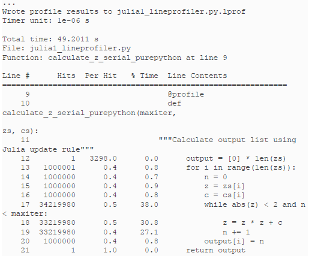

Introducing ```kernprof.py``` adds a substantial amount to the runtime. In this example, ```calculate_z_serial_purepython``` takes 49 seconds; htis is up from 8 seconds using simple print statements and 12 seconds using ```cProfile```. That gain is that we get a line-by-line breakdown of where the time is spent inside the function.

The ```% Time``` column is the most helpful - we can see that 38% of the time is spent on the ```while``` testing. We don't know whether the first statement ```abs(z) < 2``` is more expensive than the second ```n < maxiter```, though. Inside the loop, we see that the update to ```z``` is also fairly expensive. Even ```n += 1``` is expensive! Python's dynamic lookup machinery is at work for every loop, even though we're using the same types for each variable in each loop - this is where compiling and type specialization gives us a massive win. The creation of th ```output``` list and the updated on line 20 are relatively cheap compared to the cost of the ```while``` loop.

If you haven't thought about the complexity of Python's dynamic machinery before, do think about what happens in that ```n += 1``` operation. Python has to check that the ```n``` object has an ```__add__``` function (and if it didn't, it'd walk up any inherited classes to see if they provided this functionality), and then the other object (1 in this case) is passed in so that the ```__add__``` function can decide how to handle the operation. Remember that the second argument might be a ```float``` or other object that may or may not be compatible. This all happens dynamically.

The obvious way to further analyze the ```while``` statement is to break it up. While there has been some discussion in the Python community around the idea of rewriting the ```.pyc``` files with more detailed information for multipart, single-line statements, we are unaware of any production tools that offer a more fine-grained analysis than ```line_profiler```.

In the following example, we break the ```while``` logic into several statements. This additional complexity will increase the runtime of the function, as we ahve more lines of code to execute, but it *might* also help us understand the costs incurred in this part of the code.

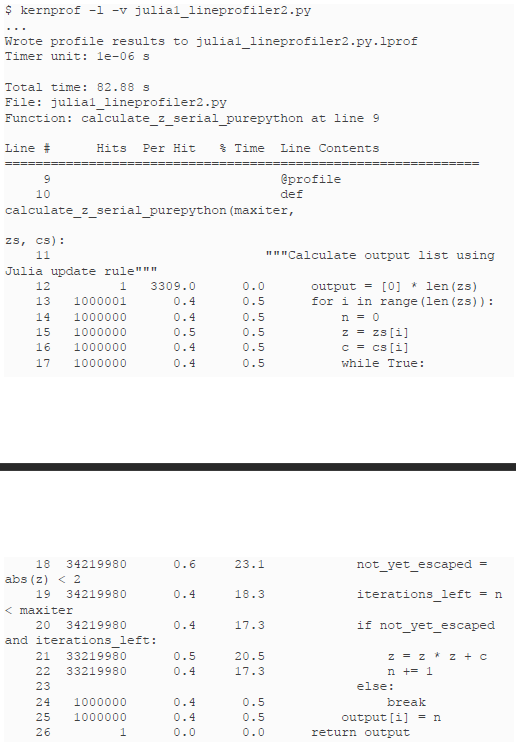

This version takes 82 seconds to execute, while the previous version took 49 seconds. Other factors *did* complicate the analysis. In this case, having extra statements that have to be executed 34219980 times each slows down the code. If we hadn't used ```kernprof.py``` to investigate the line-by-line effect of this change, we might have drawn other conclusions about the reason for the slowdown, as we'd have lacked the necessary evidence.

From this simple analysis, it looks as though the logic test of ```n``` is more than two times faster than the call to ```abs```. Since the order of evaluation for Python statements is both left to right and opportunistic, it makes sense to put the cheapest test on the left side of the equation. On 1 in every 301 tests for each coordinate, the ```n < maxiter``` test will be ```False```, so Python wouldn't need to evaluate the other side of the ```and``` operator.

We never know whether ```abs(z) < 2``` will be ```False``` until we evaluate it, and our earlier observations for this region of the complex plane suggest it is ```True``` around 10% of the time for all 300 iterations. If we wanted to have a strong understanding of the time complexity of this part of the code, it would make sense to continue the numerical analysis. In this sitatuion, however, we want an easy check to see if we can get a quick win.

We can form a new hypothesis stating, "By swapping the order of the operators in the ```while``` statement, we will achieve a reliable speedup." We *can* test this hypothesis using ```kernprof```, but the additional overhead of profiling this way might add too much noise. Instead, we can use an earlier version of the code, running a test comparing ```while abs(z) < 2``` and ```n < maxiter```: against ```while n < maxiter``` and ```abs(z) < 2```.

Running the two variants *outside* of ```line_profiler``` means they run at similar speeds. The overheads of ```line_profiler``` also confuse the result, and the results on line 17 for both version are similar. We should reject the hypothesis that in Python 3.7 changing the order of the logic results in a consistent speedup - there's no clear evidence for this.

Using a more suitable approach to solve this problem would yield greater gains.

We can be confident in our result because of the following:

* We stated a hypothesis that was easy to test.
* We changed our code so that only the hypothesis would be tested (never test two things at once!)
* We gathered enough evidence to support our conclusion.

## Using memory_profiler to Diagnose Memory Usage

Just a Robert Kern's ```line_profiler``` package measure CPU usage, the ```memory_profiler``` module by Fabian Pedregosa and Philippe Gervais measures memory usage on a line-by-line basis. Understanding the memory usage characteristics of your code allows you to ask yourself two questions:

* Could we use *less* RAM by rewriting this function to work more efficiently?
* Could we use *more* RAM and save CPU cycles by caching?

```memory_profiler``` operates in a very similar way to ```line_profiler``` but runs far more slowly. If you install the ```psutil``` package (optional but recommended), ```memory_profiler``` will run faster. Memory profiling may easily make your code run 10 to 100 times slower. In practice, you will probably use ```memory_profiler``` occasionally and ```line_profiler``` (for CPU profiling) more frequently.

Install ```memory_profiler``` with the command ```pip install memory_profiler``` (and optionally with ```pip install psutil```).

As mentioned, the implementation of ```memory_profiler``` iis not as performant as the implementation of ```line_profiler```. It may therefore make sense to run your tests on a smaller problem that completes in a useful amount of time. Overnight runs might be sensible for validation, but you need quick and reasonable iterations to diagnose problems and hypothesize solutions.

When dealing with memory allocation, you must be aware that the situation is not as clear-cut as it is with CPU usage. Generally, it is more efficient to overallocate memory in a process that can be used at leisure, as memory allocation operations are relatively expensive. Furthermore, garbage collection is not instantaneous, so object may be unavailable but still in the garbage collection pool for some time.

The outcome of this is that it is hard to really understand what is happening with memory usage and release inside a Python program, as a line of code may not allocate a deterministic amount of memory *as observed from outside the process*. Observing the gross trend over a set of lines is likely to lead to better insight than would be gained by observing the behavior of just one line.

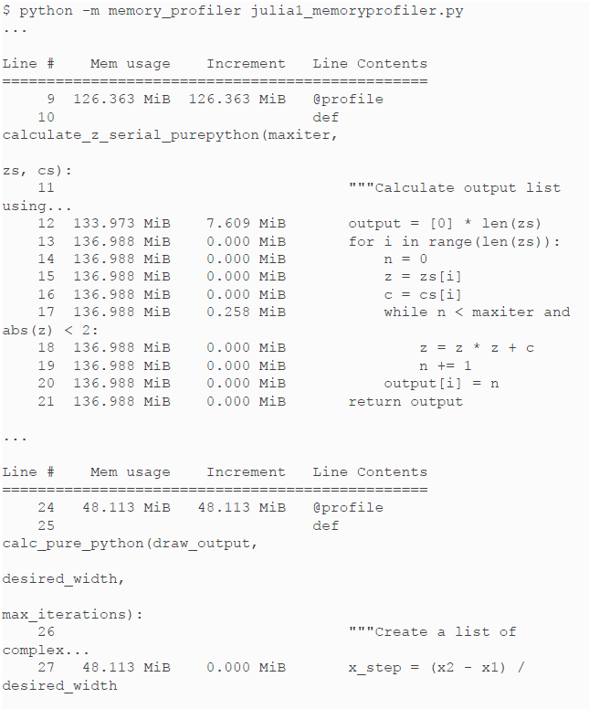
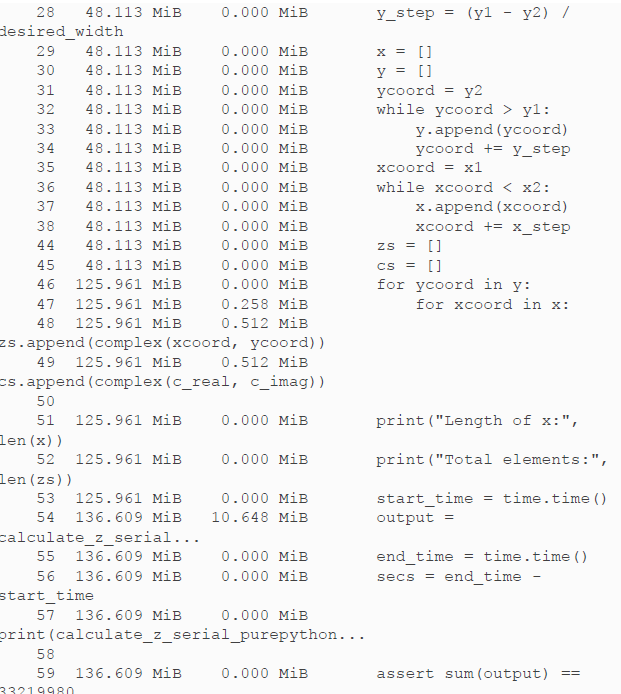

Another way to visualize the change in memory use is to sample over time and plot the result. ```memory_profiler``` has a utility called ```mprof```, used once to sample the memory usage and a second time to visualize the samples. It samples by time and not by line, so it barely impacts the runtime of the code.

The following figure sis created using ```mprof run julia_memoryprofiler.py```. This writes a statistics file that is then visualized using ```mrprof plot```. Our two functions are bracketed: this shows where in time they are entered, and we can see the growth in RAM as they run. Inside ```calculate_z_serial_purepython```, we can see the steady increase in RAM usage throughout the execution of the function; this is caused by all the small objects (```int``` and ```float``` types) that are created.

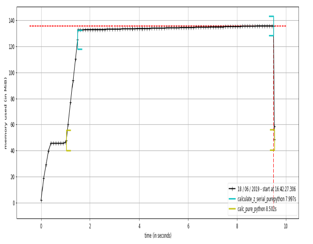

In addition to observing the behavior at the function level, we can add labels using a context manager. The snippet in the following example is used to generate the graph in the next figure. We can see the ```create_output_list``` label: it appears momentarily at around 1.5 seconds after ```calculate_z_serial_purepython``` and results in the process being allocated more RAM. We then pause for a second; ```time.sleep(1)```` is an artificial addition to make the graph easier to understand.

```python
@profile
def calculate_z_serial_purepython(maxiter, zs, cs):
    """Calculate output list using Julia update rule"""
    with profile.timestamp("create_output_list"):
      output = [0] * len(zs)
    time.sleep(1)
    with profile.timestamp("calculate_output"):
        for i in range(len(zs)):
            n = 0
            z = zs[i]
            c = cs[i]
            while n < maxiter and abs(z) < 2:
                z = z * z + c
                n += 1
            output[i] = n
    return output
```

In the ```calculate_output``` block that runs for most of the graph, we see a very slow, linear increase in RAM usage. This will be from all of the temporary numbers used in the inner loops. Using the labels really helps us to understand at a fine-grained level where memory is being consumed. Interestingly, we see the "peak RAM usage" line - a dashed vertical line just before the 10-second mark - occurring before the termination of the program. Potentially this is due to the garbage collector recovering some RAM from the temporary objects used during ```calculate_output```.

What happens if we simplify our code and remove the creation of the ```zs``` and ```cs``` lists? We then have to calculate these coordinates inside ```calculate_z_serial_purepython``` (so the same work is performed), but we'll save RAM by not storing them in lists.

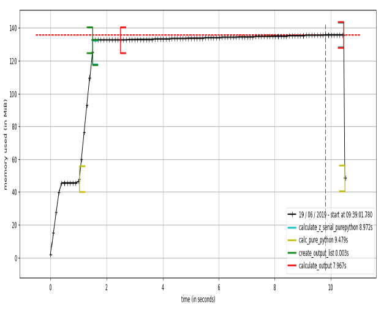

In the next figure, we see a major change in behavior - the overall envelope of RAM usage drops from 140 MB to 60 MB, reducing our RAM usage by half!

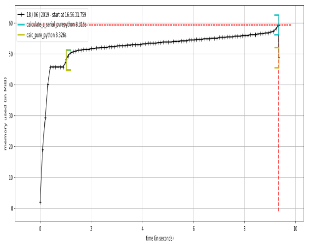

## Introspecting an existing process with PySpy

```py-spy``` is an intriguing new sampling profiler - rather than requiring any code changes, it introspects an already-running Python process and reports in the console with a ```top```-like display. Being a sampling profiler, it has almost no runtime impact on your code. It is written in Rust and requires elevated privileges to introspect another process.

This tool could be very useful in a production environment with long-running processes or complicated installation requirements. It supports Windows, Mac, and Linux. Install it using ```pip install py-spy``````. If your process is already running, you'll want to use ```ps``` to get its process identifier (the PID); then this can be passed into ```py-spy```.

## Bytecode: Under the Hood

### Using the ```dis``` Module to Examine CPython Bytecode

The ```dis``` module lets us inspect the underlying bytecode that we run inside the stack-based CPython virtual machine. Having an understanding of what's happening in the virtual machine that runs your higher-level Python code will help you to understand why some styles of coding are faster than other. It will also help when you come to use a tool like Cython, which steps outside of Python and generates C code.

The ```dis``` module is built in. You can pass it code or a module, and it will print out a disassembly.

### Different approaches, different complexity

There will be various ways to express your ideas using Python. Generally, the most sensible option should be clear, but if your experience is primarily with an older version of Python or another programming language, you may have other methods in mind. Some of these ways of expressing an idea may be slower than others.

You probably care more about readability than speed for most of your code, so your team can code efficiently without being puzzled by performant but opaque code.

Sometimes you will want performance, though (without sacrificing readability). Some speed testing might be what you need.

Take a look at the following two code snippets. Both do the same job, but the first generates a lot of additional Python bytecode, which will cause more overhead.

```python
def fn_expressive(upper=1_000_000):
    total = 0
    for n in range(upper):
        total += n
    return total


def fn_terse(upper=1_000_000):
    return sum(range(upper))
```

Both functions calculate the sum of a range of integers. A simple rule of thumb (but one you *must* back up using profiling!) is that more lines of bytecode will execute more slowly than fewer equivalent lines of bytecode that use built-in functions.

If we use the ```dis``` module to investigate the code for each function, as shown in the following example, we can see that the virtual machine has 17 lines to execute with the more expressive function and only 6 to execute with the very readable but terse second function:

```
- dis.dis(fn_expressive)

  4           0 LOAD_CONST               1 (0)
              2 STORE_FAST               1 (total)

  5           4 LOAD_GLOBAL              0 (range)
              6 LOAD_FAST                0 (upper)
              8 CALL_FUNCTION            1
             10 GET_ITER
        >>   12 FOR_ITER                 6 (to 26)
             14 STORE_FAST               2 (n)

  6          16 LOAD_FAST                1 (total)
             18 LOAD_FAST                2 (n)
             20 INPLACE_ADD
             22 STORE_FAST               1 (total)
             24 JUMP_ABSOLUTE            6 (to 12)

  7     >>   26 LOAD_FAST                1 (total)
             28 RETURN_VALUE
```

```
- dis.dis(fn_terse)

 11           0 LOAD_GLOBAL              0 (sum)
              2 LOAD_GLOBAL              1 (range)
              4 LOAD_FAST                0 (upper)
              6 CALL_FUNCTION            1
              8 CALL_FUNCTION            1
             10 RETURN_VALUE
```

The difference between the two code blocks is striking. Inside ```fn_expressive()```, we maintain two local variables and iterate over a list using a ```for``` statement. The ```for``` loop will be checking to see if a ```StopIteration``` exception has been raised on each loop. Each iteration applies the ```total.__add__``` function, which will check the type of the second variable (```n```) for each iteration. These checks all add a little expense.

Inside ```fn_terse()```, we call out to an optimized C list comprehension function that knows how to generate the final result without creating intermediate Python objects. This is much faster, although each iteration must still check for the types of the objects that are being added together.

As noted previously, you *must* profile your code - if you just rely on this heuristic, you will inevitably write slower code at some point. It is definitely worth learning whether a shorter and still readable way to solve your problem is built into Python. If so, it is more likely to be easily readable by another programmer, and it will *probably* run faster.

### Unit testing during optimization to maintain correctness

Add unit tests to your code for a saner life. You'll be giving your current self and your colleagues faith that your code works, and you'll be giving a present to your future-self who has to maintain this code later. You really will save a lot of time in the long term by adding tests to your code.

In addition to unit testing, you should also strongly consider using ```coverage.py```. It checks to see which lines of code are exercise by your tests and identifies the sections that have no coverage. This quickly lets you figure out whether you're testing the code that you're about to optimize, such that any mistakes that might creep in during the optimization process are quickly caught.

## Strategies to Profile Your Code Successfully

Profiling requires some time and concentration. You will stand a better chance of understanding your code if you separate the section you want to test from the main body of your code. YOu can then unit test hte code to preserve correctness, and you can pass in realistic fabricated data to exercise the inefficiencies you want to address.

Do remember to disable any BIOS-based accelerators, as they will only confuse your results.

Your operating system may also control the clock speed - a laptop on battery power is likely to more aggressively control CPU speed than a laptop on AC power. To create a more stable benchmarking configuration, we do the following:

* Disable Turbo Boost in the BIOS.
* Disable the operating system's ability to override the SpeedStep (you will find this in your BIOS if you're allowed to control it.)
* Use only AC power (never battery power)
* Disable background tools like backups and Dropbox while running experiments.
* Run the experiments many times to obtain a stable measurement.
* Possibly drop to run level 1 (Unix) so that no other tasks are running.
* Reboot and rerun the experiments to double-confirm the results.

Try to hypothesize the expected behavior of your code and then validate (or disprove!) the hypothesis with the result of a profiling step. Your choices will not change (you should only drive your decisions by using the profiled results), but your intuitive understanding of the code will improve, and this will pay off in future projects as you will be more likely to make performant decisions. Of course, you will verify these performant decisions by profiling as you go.

Do not skimp on the preparation. If you try to performance test code deep inside a large project without separating it from the larger project, you are likely to witness side effects that will sidetrack your efforts. It is likely to be harder to unit test a large project when you're making fine-grained changes, and this may further hamper your efforts. Side effects could include other threads and processes impacting CPU and memory usage and networking and disk activity, which will skew your results.

Naturally, you're already using source code control, so you'll be able to run multiple experiments in different branches without ever losning "the version that work well."

For web servers, investigate *dowser* and *dozer*; you can use these to visualize in real time the behavior of objects in the namespace. Definitely consider separating the code you want to test out of the main web application if possible, as this will make profiling significantly easier.

Make sure your unit tests exercise all the code paths in the code that you're analyzing. Anything you don't test that is used in your benchmarking may cause subtle errors that will slow down your progress. Use ```coverage.py``` to confirm that your tests are covering all the code paths.

Unit testing a complicated section of code that generates a large numerical output may be difficult. Do not be afraid to output a text file of results to run though ```diff``` or to use a ```pickled``` object.

If your code might be subject to numerical rounding issues due to subtle changes, you are better off with a large output that can be used for a before-and-after comparison. One cause of rounding errors is the difference in floating-point precision between CPU registers and main memory. Running your code through a different code path can cause subtle rounding errors that might later confound you - it is better to be aware of this as soon as they occur.

Obviously, it makes sense to use a source code control tool while you are profiling and optimizing. Branching is cheap, and it will preserve your sanity.
